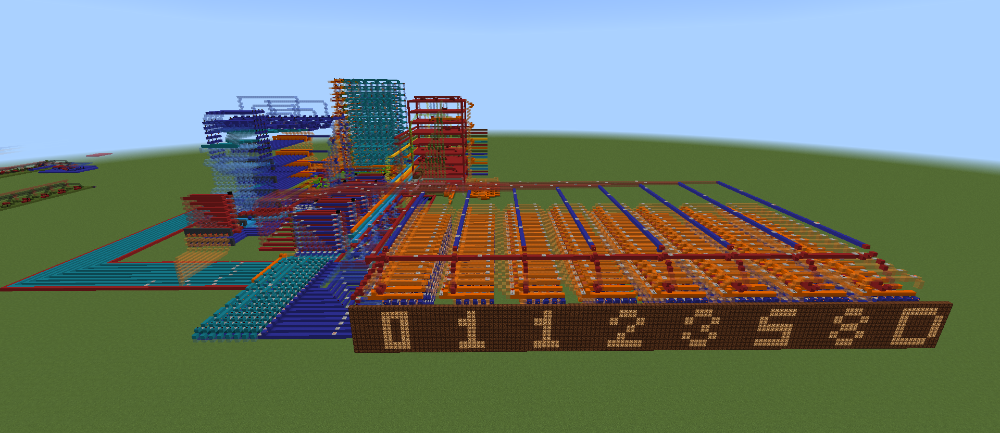

# 8-Bit CPU

- 32 bytes of RAM, expandable to 256

Needs manual RAM instruction input for now. Use the [instruction reference file](cpu_instructions.org) or the assembler to generate the machine code instructions.

